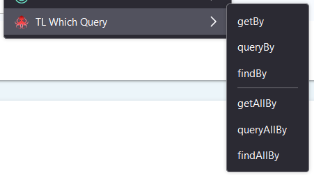
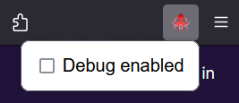

# tl-which-query

A Firefox addon which helps finding a Testing Library selector for any element in the page

# Instalation

Firefox - [addons.mozilla.org/en-US/firefox/addon/tl-which-query/](https://addons.mozilla.org/en-US/firefox/addon/tl-which-query/)

# Usage

Use right click on an element to display the context menu.

Click on a selector type from the context menu.

If a selector query was found, then it will be displayed in the browser's console and also copied into clipboard.

Note: not all websites allows to this addon/extension to work on them.

# Supported selectors/query

* getBy
* queryBy
* findBy
* getAllBy
* queryAllBy
* findAllBy

# Examples

* `screen.queryByRole('button', {name: 'Submit'})`
* `within( screen.findByRole('row', {name: '...'}) ).getByRole('button', {name: 'Submit'})`
* `within( within( within( screen.getByRole('table', {name: '...'}) )
.getByRole('row', {name: '...'}))
.getByRole('cell', {name: '...'}))
.getByRole('button', {name: 'Add'})`
* `within( screen.findByRole('table', {name: '...'}) ).getAllByRole('cell', {name: '...'})[2]`

# Tips

If you do queries into a table, replace `.getByRole('row', {name: '...'})` with `.getAllByRole('row')[<index>]`.

Do the same for the role `cell`.

# Screenshots

## Context menu

## Popup menu

# Debug

When the debug is activated, this addon/extension will apply colors to text and background of matched elements when a selector is choose from the context menu. The goal of this visual marking is to have a visual representation of what is selected by the query.

The setting for debug will be applied for all websites.

Turning off the debug will not remove the color applied to the elements.

To remove the marking produce by debug, please relaod the page.

# Copyright logo

The copyrigth for the Testing Library (the octopus) logo belongs to [Testing Library](https://testing-library.com/).